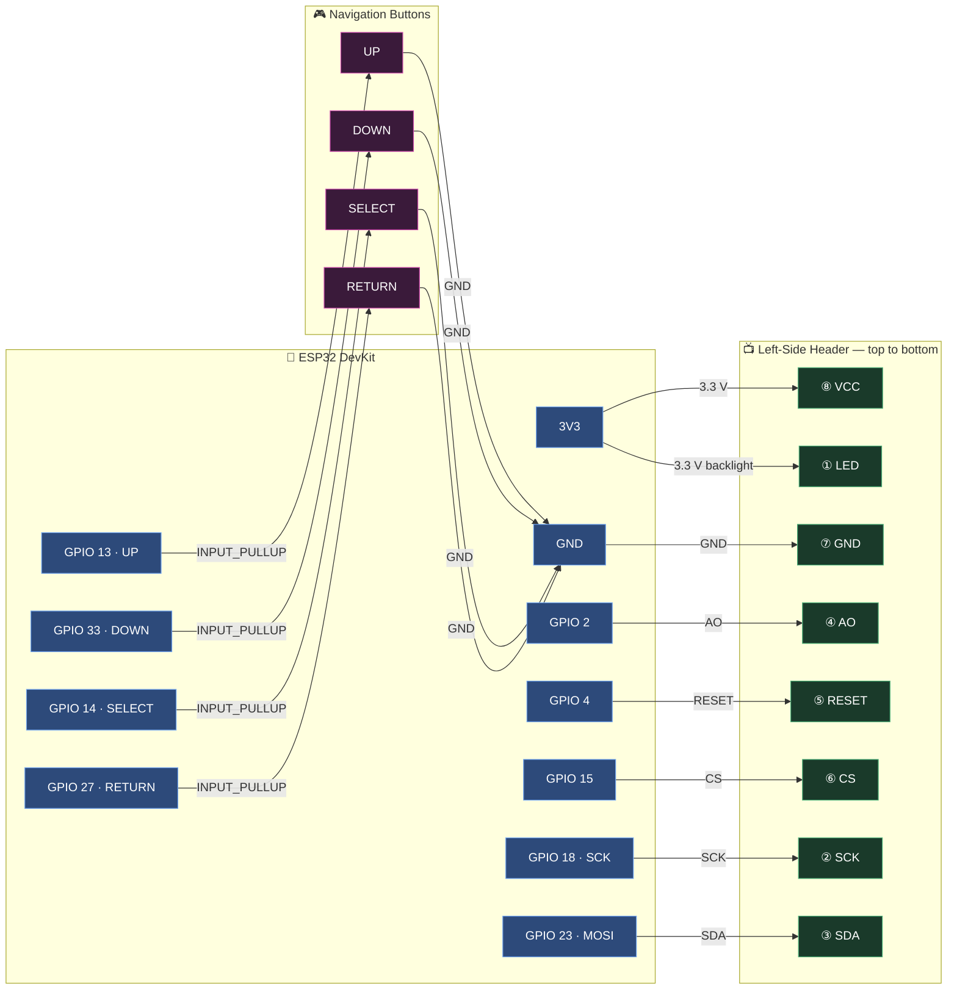

# WIRING.md — FiskeyPass v4 Hardware Connection Guide
## ESP32 ↔ ST7735 TFT + Navigation Buttons

> **v4**: SD card removed since v2.5.1. Storage is handled by the
> **ESP32 internal 4 MB flash via LittleFS** — no external SD card needed.

---

## Module Pin Layout

Your specific module exposes pins exactly as follows (listed top-to-bottom as
physically printed on the PCB):

| Row | Pins (top → bottom) | Notes |
|-----|---------------------|-------|
| **Left side** (soldered header) | `LED` `SCK` `SDA` `AO` `RESET` `CS` `GND` `VCC` | TFT display interface |
| **Right side** (bare holes) | ~~`SD_CS` `SD_MOSI` `SD_MISO` `SD_SCK`~~ | **Not used in v2.5.1 — leave unconnected** |

---

## Connection Table

Rows are listed in the **same top-to-bottom order** as the physical pins on
your board.

### Left-Side Header — TFT Display (top → bottom)

| Position | Your Label | ESP32 GPIO | Function |
|:--------:|:----------:|:----------:|:---------|
| 1 (top)  | `LED`      | **3V3**    | Backlight power — always-on |
| 2        | `SCK`      | **GPIO 18**| SPI Clock |
| 3        | `SDA`      | **GPIO 23**| SPI MOSI — TFT data in |
| 4        | `AO`       | **GPIO 2** | Data / Command select (D/C) |
| 5        | `RESET`    | **GPIO 4** | Hardware reset (active LOW) |
| 6        | `CS`       | **GPIO 15**| TFT Chip Select (active LOW) |
| 7        | `GND`      | **GND**    | Ground |
| 8 (btm)  | `VCC`      | **3V3**    | 3.3 V power supply |

### Right-Side Holes — Storage

**Leave all SD right-side holes unconnected.** LittleFS uses the ESP32 internal
flash exclusively; no wiring to the SD pads is required or recommended.

### Navigation Buttons

All buttons use the ESP32 internal `INPUT_PULLUP` — **no external resistors
needed**. Wire each button between the GPIO pin and **GND**.

| Button   | ESP32 GPIO  | Wiring                          | Special function |
|:--------:|:-----------:|:--------------------------------|:----------------|
| UP       | **GPIO 13** | Tactile switch → GND            | Cycle digit up in PIN entry |
| DOWN     | **GPIO 33** | Tactile switch → GND            | Cycle digit down in PIN entry |
| SELECT   | **GPIO 14** | Tactile switch → GND            | Confirm digit / enter |
| RETURN   | **GPIO 27** | Tactile switch → GND            | Go back; **hold at boot** → AP mode |

> **Tip:** Place the four buttons in a diamond or row layout on your breadboard
> for ergonomic navigation. A common layout is: UP top, DOWN bottom, SELECT
> right, RETURN left.
>
> **Web Portal:** Select **Web Portal** from the Main Menu. The device writes a flag and
> reboots into AP mode (`FiskeyPass-Setup`, password: `FiskeyAdmin123`). The PIN unlock
> modal in the browser handles vault authentication — no separate portal credentials needed.

---

## Wiring Diagram (Mermaid)



---

## Storage: LittleFS (Internal Flash)

FiskeyPass v4 uses the **ESP32 internal 4 MB flash** via the LittleFS
filesystem. No external SD card is needed or used.

| File | Purpose |
|------|---------|
| `/config.json` | PIN hash (SHA-256), display timeout preference |
| `/vault.enc` | AES-256-GCM encrypted credential store |

Both files are created automatically at runtime on first boot. You do **not**
need to pre-flash any files.

---

## LittleFS Data Upload Tool (Optional)

The data upload tool is only needed if you want to pre-load files (e.g., a
converted splash image) before first boot.

1. Download and install **`arduino-esp32fs-plugin`** from:
   <https://github.com/lorol/arduino-esp32fs-plugin>

2. Create a `data/` folder inside the sketch directory:
   ```
   FiskeyPass/
   ├── FiskeyPass.ino
   ├── data/           ← place pre-load files here
   │   └── (optional files)
   └── ...
   ```

3. In Arduino IDE: **Tools → ESP32 LittleFS Data Upload**

4. This flashes the contents of `data/` to the LittleFS partition on the ESP32.

> **Note:** For FiskeyPass the vault and config are generated at runtime on
> first boot, so the data upload tool is **optional** — mainly useful for
> pre-loading a splash image if you convert `whoami.jpg` to a 160×128 RGB565
> array and store it as a file.

---

## Key Wiring Notes

1. **No SD card** — The right-side SD holes on your module are unused in v2.5.1.
   Leave them unconnected. The SD library is not included in the firmware.

2. **No level shifting required** — The ESP32 runs at 3.3 V logic. The ST7735
   is 3.3 V compatible.

3. **Backlight (`LED` pin, position ①)** — Tie directly to 3V3 for always-on
   backlight. If you want software brightness control, connect to a PWM-capable
   GPIO and uncomment `TFT_BL` in `Project_Config.h`.

4. **Decoupling capacitors** — Place a 100 nF ceramic capacitor between 3V3
   and GND close to the module VCC pin to prevent SPI glitches.

5. **Navigation buttons** — Each tactile switch connects between its GPIO pin
   and GND. The internal pull-up (enabled via `INPUT_PULLUP`) holds the line
   HIGH when not pressed; pressing pulls it LOW. No external resistors needed.

6. **GPIO 33** — Used for the DOWN button. GPIO 33 is input-only on the ESP32
   (no internal pull-up on some modules). If the button appears to always read
   LOW, add an external 10 kΩ pull-up resistor between GPIO 33 and 3V3.

7. **BLE + WiFi radio sharing** — BLE and WiFi share the same ESP32 radio.
   In normal vault mode BLE is enabled and WiFi is off. In web portal mode
   (RETURN held at boot) WiFi AP is active and BLE is disabled. The firmware
   handles this automatically.

---

## Quick Cross-Reference: Config ↔ Wiring

| `Project_Config.h` Macro | Value | Physical Wire |
|:------------------------:|:-----:|:-------------|
| `TFT_CS`   | 15 | ESP32 GPIO 15 → module pin `CS` (position ⑥) |
| `TFT_DC`   |  2 | ESP32 GPIO 2  → module pin `AO` (position ④) |
| `TFT_RST`  |  4 | ESP32 GPIO 4  → module pin `RESET` (position ⑤) |
| `TFT_MOSI` | 23 | ESP32 GPIO 23 → module pin `SDA` (position ③) |
| `TFT_SCLK` | 18 | ESP32 GPIO 18 → module pin `SCK` (position ②) |
| `PIN_BTN_UP`     | 13 | ESP32 GPIO 13 → tactile switch → GND |
| `PIN_BTN_DOWN`   | 33 | ESP32 GPIO 33 → tactile switch → GND |
| `PIN_BTN_SELECT` | 14 | ESP32 GPIO 14 → tactile switch → GND |
| `PIN_BTN_RETURN` | 27 | ESP32 GPIO 27 → tactile switch → GND |
